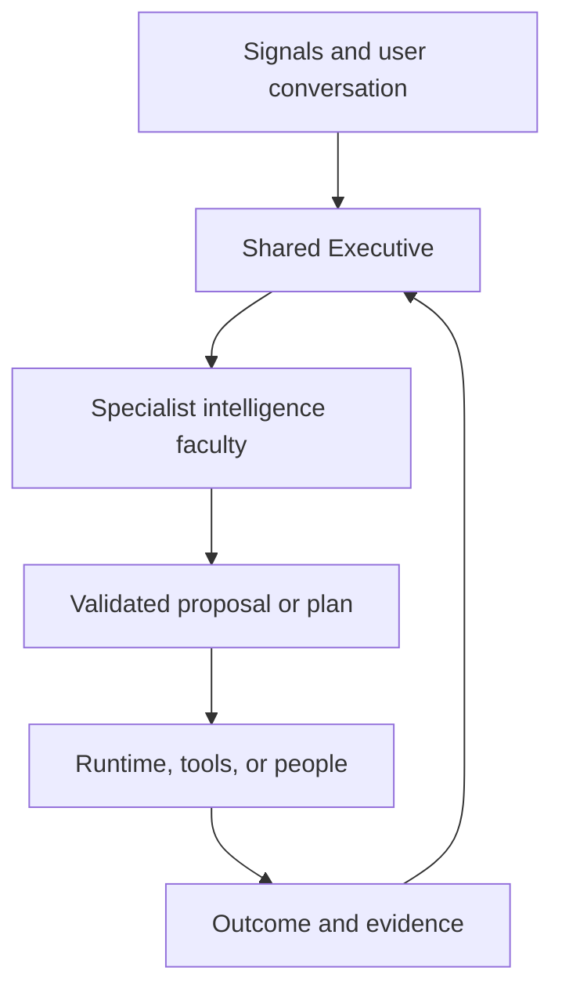

# Brain Intelligence Map

**Status:** Canonical working blueprint  
**Date:** September 18, 2026  
**Purpose:** Define the major forms of intelligence Brain needs, explain what judgment each adds, and show how they combine into one persistent intelligence.

---

## 1. What This Map Is

Brain is intended to be a persistent autonomous intelligence, not a chatbot with a collection of disconnected workflows.

It already has or is developing much of the necessary substrate:

- persistent memory and knowledge;
- project and global state;
- the Graph Kernel and Wells;
- research packets, claims, evidence, provenance, and audits;
- durable work items, leases, checkpoints, and restart recovery;
- Routines and workers;
- permissions, authority, budgets, and approval gates;
- tools, connectors, and external systems;
- the Software Factory;
- evaluation and failure memory;
- and Russell as the user-facing identity.

Those systems are essential, but they do not automatically create intelligence. Memory can store something without understanding it. A worker can complete a task without knowing whether the task matters. A workflow can advance through every state while solving the wrong problem. An evidence system can verify claims without deciding which claims were worth investigating.

This map defines the major forms of judgment Brain needs above that machinery.

The architecture has three layers:

1. **The Shared Executive** maintains the active understanding of the whole situation and decides which faculty should think.
2. **Fourteen Intelligence Faculties** provide specialized forms of reasoning.
3. **Supporting Infrastructure** stores state, performs work, enforces boundaries, connects tools, and measures outcomes.

The faculties are not fourteen separate personalities or fourteen isolated agents. They are reusable cognitive powers belonging to one Brain. A faculty may be implemented through one model pass, several specialist passes, deterministic solvers, or a combination. The important distinction is responsibility: each faculty adds a different kind of judgment.

---

## 2. The Shared Executive: The Mind That Coordinates the Faculties

The Shared Executive is the missing central “Brain part.” It is not merely another worker and it is not a fifteenth specialist department. It is the coordinating mind that maintains the active situation and calls the other faculties when their form of reasoning is needed.

The Executive maintains:

- current goals and their hierarchy;
- active missions and projects;
- beliefs and their confidence;
- unresolved uncertainty;
- current plans and why they exist;
- commitments already made;
- authority actually granted;
- risks and conflicts;
- attention priorities;
- expected outcomes;
- important changes since the last decision;
- and what Brain currently believes should happen next.

Its basic loop is:

1. **Observe:** Receive a user statement, research result, worker event, outside change, failure, deadline, or outcome.
2. **Interpret:** Determine what happened and what it means in context.
3. **Update:** Propose changes to beliefs, goals, plans, uncertainty, or commitments.
4. **Evaluate significance:** Determine which active goals, assumptions, risks, or dependencies are affected.
5. **Choose attention:** Decide what deserves thought now, what can wait, and what should be ignored.
6. **Call faculties:** Request research, simulation, invention, planning, criticism, or another form of intelligence.
7. **Compare options:** Consider possible responses and their consequences.
8. **Decide:** Select or recommend the next move within its authority.
9. **Delegate:** Send bounded work to Routines, the Software Factory, tools, or people.
10. **Observe results:** Compare reality with the prediction and revise.

The Executive proposes meaning, priorities, plans, belief changes, and actions. Deterministic systems enforce structure, permissions, privacy, budgets, and legal state transitions. This allows Brain to exercise judgment without giving an unconstrained language model the power to rewrite truth or perform unauthorized actions.

### Executive state

The Executive needs a compact, continuously updated mental state containing:

| State | Meaning |
|---|---|
| Observations | What was directly received or measured |
| Beliefs | What Brain currently thinks is true |
| Goals | Outcomes Brain is trying to advance |
| Constraints | Conditions that genuinely may not be violated |
| Preferences | Conditions that should usually be respected but can be reconsidered |
| Commitments | Decisions, promises, or obligations already made |
| Authority | What Brain is permitted to decide or execute |
| Uncertainties | Questions whose answers may change a decision |
| Plans | Current theories of how actions could produce goals |
| Attention | What matters now |
| Predictions | What Brain expects to happen |
| Outcomes | What actually happened |
| Lessons | What should change in future reasoning |

Every faculty reads some portion of this state and returns structured proposals. The Executive reconciles those proposals into one coherent course of action.

---

## 3. How the Whole Brain Operates

The general flow is:

The same objective may move through several faculties. Brain should not force every problem through all fourteen. The Executive calls only the faculties that add material value.

For example, a straightforward factual question may need Intent, World Model, and Research. A new business mechanism may need Intent, Strategy, Creative Invention, Research, Simulation, Judgment, Planning, Execution, Sensing, and Learning. A software failure may need World Model, Planning, Metacognition, Collective Intelligence, Execution, and Learning.

The faculties share structured objects rather than passing disconnected prose:

- interpreted intents;
- goals and success criteria;
- observations and beliefs;
- decision-relevant uncertainties;
- evidence and claims;
- causal and numerical models;
- options and scenarios;
- decisions and rationales;
- plans and dependencies;
- experiments and actions;
- outcomes and prediction scores;
- lessons and candidate system changes;
- capability gaps and acquired capabilities.

These shared objects allow one faculty’s output to become another faculty’s input without losing provenance or meaning.

---

## 4. The Fourteen Major Intelligence Faculties

| # | Faculty | Central question |
|---:|---|---|
| 1 | Research Intelligence | What must we learn, and when do we know enough? |
| 2 | Simulation and Modeling Intelligence | What could happen, through what mechanism, and with what range of outcomes? |
| 3 | Intent and Context Intelligence | What does the person actually mean here? |
| 4 | Knowledge and World-Model Intelligence | What does Brain currently believe reality is like? |
| 5 | Strategic Intelligence | What matters most, and where is the leverage? |
| 6 | Decision and Judgment Intelligence | Which option should be chosen under uncertainty? |
| 7 | Planning and Problem-Solving Intelligence | How can the desired outcome actually be produced? |
| 8 | Creative and Invention Intelligence | What new possibilities, mechanisms, or forms can be created? |
| 9 | Execution and Experimentation Intelligence | What should be tried or done, and what did reality reveal? |
| 10 | Learning and Self-Improvement Intelligence | How should experience permanently improve Brain? |
| 11 | Metacognitive Intelligence | Is Brain thinking about this correctly? |
| 12 | Continuous Sensing Intelligence | What changed or appeared without being explicitly requested? |
| 13 | Collective and Organizational Intelligence | How should many minds and workers act as one system? |
| 14 | Capability-Acquisition Intelligence | What ability is missing, and how can Brain acquire it? |

---

# 5. Intelligence Faculty Definitions

## 5.1 Research Intelligence

### Purpose

Research Intelligence determines what Brain needs to learn in order to support a decision, plan, model, creation, or action. It is much larger than web search and much deeper than producing reports.

Its fundamental unit is a **decision-relevant uncertainty**: a coherent unknown whose answer could change what Brain believes or does.

### Core judgments

Research Intelligence decides:

- what question is actually being asked;
- what downstream decision or deliverable will use the answer;
- what Brain already knows;
- what is assumed rather than established;
- which unknowns could invalidate an entire path;
- which questions deserve shallow scouting or deep investigation;
- how to divide work without fragmenting meaning;
- which sources and evidence types fit each claim;
- when contradictory evidence requires adversarial research;
- when a weak branch should be killed;
- when findings require a new research plan;
- when remaining uncertainty matters;
- and when evidence is sufficient for the intended use.

### Internal loop

1. Interpret the research objective.
2. Retrieve applicable existing knowledge.
3. Build a problem model.
4. Identify decisive uncertainties.
5. Run the cheapest informative scout.
6. Create bounded fragments around independent uncertainties.
7. Assign fragments to Routines or other research executors.
8. Evaluate claims, evidence, coverage, and contradictions.
9. Replan from the findings.
10. Synthesize across the campaign.
11. Judge sufficiency.
12. Promote reusable validated knowledge.
13. Evaluate the campaign afterward.

The initial plan should not be treated as final. Brain may retire irrelevant work, deepen surviving branches, create follow-up questions, choose alternate sources, and stop when more research has little decision value.

### Inputs from Brain

- interpreted objective from Intent Intelligence;
- active goals and stakes from the Executive;
- existing beliefs from the World Model;
- decision criteria from Strategy or Judgment;
- permission and privacy boundaries;
- available tools, workers, budgets, and time.

### Outputs to Brain

- validated or rejected claims;
- explicit uncertainty;
- contradictions;
- belief-update proposals;
- decision-grade synthesis;
- new questions;
- research gaps;
- suggested experiments or simulations;
- shared findings eligible for Knowledge Promotion;
- and research lessons.

### Connections

- **Intent Intelligence** protects research from literal wording and false restrictions.
- **World-Model Intelligence** supplies prior knowledge and receives validated belief updates.
- **Strategic Intelligence** tells research which unknowns matter most.
- **Simulation Intelligence** exposes sensitive assumptions that research should measure.
- **Judgment Intelligence** consumes the synthesis.
- **Execution Intelligence** can run real-world tests when observation alone is insufficient.
- **Metacognition** challenges framing, evidence standards, and premature conclusions.
- **Learning Intelligence** evaluates which research choices were useful.
- **Collective Intelligence** coordinates parallel investigators without losing one agenda.

### Failure without it

Brain may collect impressive amounts of evidence while missing the decisive question. It may research every category equally, treat access failures as rejection, erase valid claims from incomplete fragments, concatenate summaries instead of reasoning, or keep researching after the answer is already decision-ready.

### Boundary

Research Intelligence proposes what is true and what remains unknown. It does not grant authority, perform external actions, or make every final decision.

---

## 5.2 Simulation and Modeling Intelligence

### Purpose

Simulation and Modeling Intelligence converts beliefs about a system into explicit representations of how outcomes may be produced. It allows Brain to reason about futures, uncertainty, bottlenecks, causal mechanisms, capacity, cash flow, schedules, and tradeoffs before reality has fully unfolded.

Its purpose is not to manufacture thousands of impressive-looking numbers. A useful model may contain only eight to twenty important variables. The value comes from honest inputs, defensible relationships, and knowing which missing numbers matter.

### Core judgments

This faculty decides:

- what kind of model fits the question;
- which variables actually drive the outcome;
- which inputs are observed, sourced, estimated, assumed, derived, simulated, or merely targets;
- how variables interact;
- which correlations or causal relationships are defensible;
- what constraints and units apply;
- which uncertainties require distributions rather than point estimates;
- which scenarios deserve comparison;
- what the model is sensitive to;
- what information would most improve the decision;
- and when the model is too weak to support a forecast.

### Model families

- Unit economics.
- Funnel models.
- Cash-flow and timeline models.
- Monte Carlo outcome distributions.
- Queue and capacity simulations.
- Decision trees.
- Portfolio allocation and optimization.
- Schedule and cost-overrun models.
- System-dynamics models.
- Causal models.
- Agent-based or market simulations.
- Counterfactual scenario comparisons.

Language models may design, explain, and critique models. Deterministic software should perform arithmetic, sampling, optimization, unit checks, and reproducible calculations.

### Inputs from Brain

- causal beliefs from the World Model;
- factual ranges from Research;
- objectives and thresholds from Strategy;
- options from Creative Intelligence or Planning;
- observed operational data;
- resource and authority constraints.

### Outputs to Brain

- outcome distributions rather than fake precise forecasts;
- best, typical, and adverse cases;
- probability of reaching thresholds;
- bottlenecks;
- required resources;
- sensitivity rankings;
- break-even points;
- assumptions that dominate uncertainty;
- model invalidation conditions;
- and the highest-value variables to research or test next.

### Connections

- **Research Intelligence** supplies defensible inputs and investigates sensitive unknowns.
- **World-Model Intelligence** supplies the system structure and receives calibrated relationships.
- **Strategy** uses scenarios to compare leverage and resource allocation.
- **Judgment** uses distributions and risk rather than single guesses.
- **Planning** uses modeled dependencies, duration, capacity, and cash exposure.
- **Execution** replaces assumptions with observed results.
- **Learning** scores forecasts and recalibrates future models.
- **Metacognition** checks whether mathematical formality is hiding weak assumptions.

### Failure without it

Brain is forced to use vague adjectives such as likely, scalable, cheap, or fast. It cannot expose the assumptions driving a forecast, distinguish targets from expected outcomes, or identify the cheapest fact that would reduce uncertainty.

### Boundary

A simulation is a conditional representation, not reality. Ten thousand runs of a weak model do not make the assumptions true. This faculty must sometimes refuse to produce a forecast and identify the test required to make modeling useful.

---

## 5.3 Intent and Context Intelligence

### Purpose

Intent and Context Intelligence determines what a person actually means within the surrounding conversation, history, project, relationships, and current situation.

It protects Brain from treating language as a literal specification when the user was giving an example, exploring an idea, venting, expressing a temporary preference, or authorizing only a limited step.

### Core judgments

It distinguishes:

- command;
- question;
- goal;
- preference;
- hard constraint;
- example;
- analogy;
- speculation;
- correction;
- frustration;
- tentative idea;
- permanent principle;
- temporary choice;
- approval;
- consent;
- authorization;
- commitment;
- and casual conversation.

It preserves not only the statement but the reason, scope, strength, time horizon, and conditions under which it applies.

For example, “wait for my friends” may express a temporary fairness preference. Without the reason and scope, a local feature can incorrectly convert it into a permanent technical lock.

### Inputs from Brain

- current conversation;
- prior interactions and corrections;
- project state;
- known preferences and principles;
- current goals;
- identity and relationship context;
- existing commitments and authority.

### Outputs to Brain

- interpreted intent;
- semantic type;
- scope;
- confidence;
- linked goals;
- constraints versus preferences;
- examples separated from requirements;
- authority actually granted;
- ambiguities that materially matter;
- and the smallest necessary clarification when Brain truly cannot infer safely.

### Connections

- **Executive:** supplies the correct meaning of new events.
- **Research:** prevents examples from becoming research boundaries.
- **Strategy:** distinguishes an enduring goal from a passing thought.
- **Judgment:** provides the actual values and tradeoffs that should govern a choice.
- **Planning:** prevents an idea from silently becoming an active plan.
- **Execution:** prevents discussion from becoming unauthorized action.
- **World Model:** stores contextualized preferences instead of decontextualized quotations.
- **Learning:** uses user corrections to improve general interpretation without overfitting.

### Failure without it

Brain becomes a literal bureaucracy. It can correctly implement words while violating the user’s actual intention. Examples become whitelists, temporary decisions become permanent rules, and brainstorms become tasks.

### Boundary

Intent Intelligence does not automatically obey every interpreted desire. It explains what the person means. Strategy, Judgment, Policy, and Authority determine what Brain should recommend or may execute.

---

## 5.4 Knowledge and World-Model Intelligence

### Purpose

Knowledge and World-Model Intelligence maintains Brain’s evolving understanding of reality.

This is not merely document retrieval or a vector database. It represents entities, events, relationships, mechanisms, histories, temporal changes, causal beliefs, uncertainty, contradictions, and the boundaries of what Brain knows.

### Core judgments

It decides:

- whether two references describe the same entity;
- whether a fact is current, historical, superseded, or context-specific;
- how observations support or challenge beliefs;
- whether a claim applies globally or only under certain conditions;
- which relationships are causal, correlational, asserted, or speculative;
- how a new fact changes connected beliefs;
- what information is missing;
- and when the world model should say unknown.

### Major representations

- entities and identities;
- attributes and time-varying states;
- relationships;
- events;
- claims and evidence;
- causal mechanisms;
- plans and institutions;
- locations and jurisdictions;
- preferences and personal context;
- confidence and uncertainty;
- contradictions;
- provenance and permissions;
- freshness, expiry, revocation, and supersession.

The world model should support multiple possible interpretations where reality is unsettled. It should not force every contradiction into one premature canonical answer.

### Inputs from Brain

- validated research findings;
- direct observations;
- user corrections;
- external system state;
- experiment results;
- decisions and outcomes;
- simulation calibration;
- sensed changes.

### Outputs to Brain

- context compilations;
- current belief state;
- relevant entities and relationships;
- causal hypotheses;
- historical trajectories;
- contradictions;
- knowledge gaps;
- freshness warnings;
- and downstream change propagation.

### Connections

Every faculty depends on the World Model:

- **Intent** uses personal and conversational context.
- **Research** retrieves prior knowledge and updates beliefs.
- **Simulation** obtains variables and causal structure.
- **Strategy** identifies the real environment, actors, and constraints.
- **Planning** uses dependencies and system state.
- **Sensing** compares new observations with expected reality.
- **Learning** stores generalized lessons.
- **Capability Acquisition** uses the capability registry.

### Failure without it

Brain repeatedly rediscovers facts, loses the reason behind decisions, cannot determine what changed, applies stale conclusions to new contexts, and treats retrieved passages as understanding.

### Boundary

The Graph Kernel and Wells are storage and retrieval substrate. World-Model Intelligence is the judgment that decides what the stored information means, how it relates, when it applies, and how it should change.

---

## 5.5 Strategic Intelligence

### Purpose

Strategic Intelligence determines what matters, where leverage exists, and how Brain should position attention and resources across competing goals and possible paths.

It operates above individual plans. Planning asks how to accomplish an outcome. Strategy asks which outcomes or approaches deserve pursuit and why.

### Core judgments

It identifies:

- goal hierarchy;
- leverage points;
- bottlenecks;
- opportunities and threats;
- timing and sequencing advantages;
- competitive or institutional dynamics;
- asymmetric upside;
- option value;
- resource concentration versus diversification;
- conflicts among goals;
- what should be accelerated, deferred, watched, combined, or abandoned;
- and what matters most now.

Strategic Intelligence should evaluate both direct value and how a move changes future possibilities. A project may be valuable because it makes ten later projects possible, creates information, builds a capability, establishes access, or preserves optionality.

### Inputs from Brain

- goals and values;
- current world model;
- opportunities and threats from Sensing;
- research findings;
- simulated futures;
- available capital, time, people, tools, and attention;
- active commitments;
- capability portfolio;
- and outcome history.

### Outputs to Brain

- priority proposals;
- strategic theses;
- resource-allocation recommendations;
- leverage maps;
- portfolio choices;
- sequencing decisions;
- kill, defer, watch, combine, or promote recommendations;
- and the decisive questions other faculties should answer.

### Connections

- **Intent** clarifies which goals genuinely belong to the user.
- **World Model** describes the environment in which strategy operates.
- **Sensing** identifies changes worth strategic attention.
- **Research** investigates strategic uncertainties.
- **Simulation** compares possible futures and resource exposure.
- **Creative Intelligence** generates new strategic moves.
- **Judgment** chooses among strategic options.
- **Planning** turns a strategic direction into an executable theory.
- **Learning** evaluates whether the strategy’s assumptions proved correct.

### Failure without it

Brain treats every discovered issue as equally important, optimizes local workflows while major opportunities pass, spends deeply on low-leverage work, and confuses being busy with advancing the user’s position.

### Boundary

Strategy does not execute or micromanage tasks. It determines direction, attention, portfolio position, and leverage. Plans and runtime systems handle the route and labor.

---

## 5.6 Decision and Judgment Intelligence

### Purpose

Decision and Judgment Intelligence chooses or recommends among alternatives when evidence is incomplete, values conflict, and outcomes remain uncertain.

Research can establish facts. Simulation can estimate futures. Strategy can identify what matters. Judgment integrates those outputs into a choice.

### Core judgments

It evaluates:

- available options;
- relevant values and objectives;
- evidence quality;
- uncertainty;
- expected upside and downside;
- reversibility;
- opportunity cost;
- failure severity;
- time pressure;
- confidence thresholds;
- authority;
- second-order consequences;
- and whether waiting for more information is worth the delay.

It should distinguish:

- a recommendation;
- an internal reversible decision;
- a proposed external action;
- a decision requiring approval;
- and a decision Brain is not authorized to make.

### Internal process

A consequential decision may use distinct passes:

- an interpreter states the actual decision;
- an option generator identifies credible alternatives;
- an evaluator compares them;
- a critic searches for missing assumptions and downstream damage;
- a judge selects, defers, or requests more evidence.

These are reasoning roles, not necessarily separate models.

### Inputs from Brain

- intent and values;
- current goals;
- research synthesis;
- simulated outcomes;
- strategic priorities;
- plan feasibility;
- authority constraints;
- metacognitive criticism;
- and historical outcome data.

### Outputs to Brain

- chosen option or recommendation;
- confidence;
- decisive factors;
- rejected alternatives and reasons;
- conditions that would reverse the decision;
- required approval;
- prediction of expected outcome;
- and a decision ledger entry.

### Connections

- **Research** reduces uncertainty.
- **Simulation** quantifies ranges and risks.
- **Strategy** supplies priorities.
- **Planning** tests feasibility and implements the selected direction.
- **Metacognition** challenges premature certainty and framing.
- **Learning** later scores the prediction and decision quality.
- **Authority systems** determine whether the decision can be executed.

### Failure without it

Brain may produce thorough information and multiple plans without ever committing to a clear conclusion. Alternatively, it may make arbitrary decisions based on the first plausible interpretation.

### Boundary

Judgment is not permission. A high-confidence recommendation does not override spending limits, privacy rules, consent, security boundaries, or founder authority.

---

## 5.7 Planning and Problem-Solving Intelligence

### Purpose

Planning and Problem-Solving Intelligence turns a desired outcome into an adaptive theory of how that outcome could be produced.

A plan is not merely a task list. It is a causal explanation linking actions, dependencies, resources, intermediate states, and expected observations to the goal.

### Core judgments

It decides:

- what intermediate conditions must become true;
- which dependencies are real;
- what can run in parallel;
- what must be sequenced;
- where uncertainty requires a probe;
- which resources and capabilities are required;
- what the likely bottlenecks are;
- what failure conditions should trigger revision;
- how to route around obstacles;
- and when the plan no longer serves the goal.

### Plan structure

A mature plan includes:

- intended outcome;
- success and acceptance criteria;
- assumptions;
- constraints;
- dependencies;
- milestones;
- alternative routes;
- resources;
- authority requirements;
- expected observations;
- failure conditions;
- checkpoints;
- next decision;
- and revision history.

Planning should remain responsive to reality. A completed task does not justify continuing the rest of a plan when the causal theory has failed.

### Inputs from Brain

- goal and strategy;
- decisions;
- world state;
- research findings;
- simulations;
- available capabilities;
- commitments;
- authority and resource limits;
- execution feedback.

### Outputs to Brain

- versioned plan;
- dependency graph;
- bounded work units;
- milestones and gates;
- resource requirements;
- risk and contingency paths;
- expected observations;
- replanning triggers;
- and task or bin manifests for execution.

### Connections

- **Strategy** chooses the direction.
- **Research** resolves planning uncertainties.
- **Simulation** tests duration, capacity, cash, and sensitivity.
- **Creative Intelligence** generates alternate mechanisms when obvious routes fail.
- **Execution** carries out the plan and returns observations.
- **Collective Intelligence** allocates work across people and agents.
- **Metacognition** checks whether task completion is being mistaken for goal progress.
- **Learning** improves future decomposition and estimation.

### Failure without it

Brain produces goals, research, and recommendations that never become coherent action. Workers receive unrelated tasks, dependencies are discovered too late, and activity logs replace outcome progress.

### Boundary

The Runtime schedules and tracks work. Planning Intelligence decides why the work exists, how it relates, and when the plan should change.

---

## 5.8 Creative and Invention Intelligence

### Purpose

Creative and Invention Intelligence generates possibilities that are not already present in Brain’s retrieved knowledge.

It allows Brain to invent concepts, mechanisms, products, stories, designs, institutions, strategies, experiments, and combinations rather than only selecting from existing templates.

### Core judgments

It decides:

- when the known option set is too narrow;
- which constraints are essential and which are conventional;
- what distant structures can be transferred across domains;
- which ideas are genuinely distinct;
- how ideas can be combined into a new mechanism;
- which concepts deserve development;
- how much novelty is useful;
- and how to preserve coherence while exploring unusual possibilities.

### Major modes

- Divergent generation.
- Constraint inversion.
- Mechanism invention.
- Cross-domain analogy.
- Structural-isomorphism transfer.
- Concept combination and collision.
- Counterfactual exploration.
- Aesthetic and narrative development.
- Product and system design.
- Institution and organizational design.

Generation should be followed by criticism, feasibility testing, and selection. Novelty alone is not intelligence.

### Inputs from Brain

- objective and constraints;
- personal taste and values;
- world-model structures;
- research findings;
- strategic needs;
- unresolved obstacles;
- examples and anti-examples;
- and existing concept history.

### Outputs to Brain

- novel options;
- mechanisms;
- prototypes or concept specifications;
- alternative framings;
- combinations;
- hypotheses;
- creative variations;
- and questions requiring research, simulation, or testing.

### Connections

- **Intent** protects the user’s actual aesthetic or strategic purpose.
- **World Model** supplies material and structural analogies.
- **Research** checks originality, precedent, feasibility, and factual foundations.
- **Strategy** identifies where invention could create leverage.
- **Simulation** explores consequences.
- **Judgment** selects among ideas.
- **Planning** turns selected concepts into realizable programs.
- **Execution** prototypes and tests them.
- **Learning** remembers which forms of creativity produced value.

### Failure without it

Brain becomes a highly organized curator of existing ideas. It can optimize known mechanisms but cannot originate the unusual products, films, businesses, buildings, institutions, or operating methods the user wants.

### Boundary

Creative output begins as a candidate, not a fact, decision, or authorized project. It must survive the appropriate research, judgment, feasibility, and authority gates.

---

## 5.9 Execution and Experimentation Intelligence

### Purpose

Execution and Experimentation Intelligence converts selected plans into controlled interaction with reality and interprets the result.

Execution is not merely tool use. It includes choosing the smallest meaningful action, protecting against downside, defining what should be observed, and deciding what the result means.

### Core judgments

It determines:

- what action should happen now;
- whether to run a probe, prototype, pilot, experiment, or full execution;
- what result would support or challenge the underlying belief;
- what controls, holdouts, or comparisons are needed;
- what risks and approvals apply;
- how much resource exposure is justified;
- when an action should be paused;
- whether the result is causal evidence or merely correlation;
- and how observations should update the plan.

### Execution ladder

- Internal reversible change.
- Sandbox or simulation.
- Prototype.
- Bounded probe.
- Controlled experiment.
- Limited pilot.
- Production action.
- Scaled operation.

Brain should use the lowest-risk rung capable of producing the needed evidence or result.

### Inputs from Brain

- authorized decision;
- plan and acceptance criteria;
- experiment hypothesis;
- predicted outcome;
- permissions and budgets;
- tools and available capabilities;
- risk analysis;
- and current external state.

### Outputs to Brain

- action record;
- observations;
- measured outcome;
- deviations from prediction;
- operational failures;
- evidence for causal claims;
- updated costs and timings;
- and triggers for continuation, pause, rollback, or replanning.

### Connections

- **Planning** specifies why and how execution should happen.
- **Judgment** selects and authorizes the option at the appropriate level.
- **Research** may request experiments to resolve uncertainty.
- **Simulation** predicts results and is recalibrated by actuals.
- **Sensing** monitors execution and the surrounding environment.
- **Learning** turns outcomes into durable improvement.
- **Capability Acquisition** supplies missing tools.
- **Authority and Policy** constrain material external actions.

### Failure without it

Brain remains intellectually impressive but operationally passive. Alternatively, it uses tools without controlled objectives, cannot tell whether an action worked, and mistakes successful API calls for successful outcomes.

### Boundary

Execution Intelligence does not override authority. Material ethical, personnel, customer, privacy, security, financial, irreversible, or architecture-changing actions require the appropriate human approval and deterministic guard.

---

## 5.10 Learning and Self-Improvement Intelligence

### Purpose

Learning and Self-Improvement Intelligence converts experience into lasting changes in Brain’s future behavior.

Memory stores what happened. Learning determines what general lesson follows, how broadly it applies, and whether changing Brain actually improves performance.

### Core judgments

It decides:

- what outcome counts as success or failure;
- whether a prediction was correct;
- what caused the result;
- which lesson is local and which generalizes;
- whether a user correction reveals a broad failure pattern;
- what process, prompt, policy, model, memory structure, or skill should change;
- how to test the proposed improvement;
- whether the improvement survives replay and evaluation;
- and when it should be promoted or reverted.

### Improvement loop

1. Capture the full trajectory.
2. Compare expected and actual outcomes.
3. Diagnose failure or success.
4. Distill a candidate lesson.
5. Propose a bounded system change.
6. Test it in a sandbox or replay set.
7. Run adversarial and regression evaluation.
8. Promote only demonstrated improvements.
9. Monitor for drift or unintended effects.

### Inputs from Brain

- decisions and predictions;
- plans;
- execution traces;
- outcomes;
- user corrections;
- research retrospectives;
- model performance;
- failure incidents;
- and evaluation results.

### Outputs to Brain

- generalized lessons;
- updated heuristics;
- candidate policy or prompt changes;
- reusable skills;
- improved routing;
- revised models;
- new regression tests;
- failure-network entries;
- and promotion or rollback decisions.

### Connections

- Every faculty produces trajectories for Learning.
- **Metacognition** diagnoses reasoning failures within a run; Learning generalizes across runs.
- **Evaluation** supplies controlled evidence that a change helped.
- **Software Factory** implements validated code changes.
- **World Model** stores lessons with context and scope.
- **Capability Acquisition** can turn repeated work into a retained capability.
- **Executive** decides whether a proposed improvement matters enough to pursue.

### Failure without it

Brain repeats the same mistakes, responds to each correction locally, and accumulates history without becoming more capable. A large memory can grow while effective intelligence remains flat.

### Boundary

Self-improvement must not mean uncontrolled self-modification. Candidate changes are versioned, sandboxed, evaluated, permission-checked, and reversible before promotion.

---

## 5.11 Metacognitive Intelligence

### Purpose

Metacognitive Intelligence monitors and critiques Brain’s own thinking while it is happening.

It asks whether the current framing, reasoning method, confidence, and evidence are appropriate. It is Brain’s ability to notice that it may be solving the wrong problem or rationalizing its first answer.

### Core judgments

It checks:

- whether an example became a rule;
- whether a symptom is being fixed instead of the underlying objective;
- whether assumptions were introduced silently;
- whether the current frame excludes better possibilities;
- whether confidence matches evidence;
- whether a contradiction has been ignored;
- whether a source or model is being trusted for the wrong reason;
- whether progress is genuine or merely activity;
- whether another faculty should be called;
- whether Brain is stuck;
- whether a conclusion is convenient rather than supported;
- and what evidence could falsify the current view.

### Internal roles

For consequential work, Brain may separate:

- **Interpreter:** What does this actually mean?
- **Planner:** What should we do?
- **Critic:** What is missing, literal, fragile, or damaging?
- **Judge:** Which proposal survives?

These roles create internal disagreement without requiring four permanent personalities.

### Inputs from Brain

- active problem framing;
- proposed beliefs;
- research plans;
- simulations;
- candidate decisions;
- plans;
- confidence;
- evidence and contradictions;
- historical failure patterns.

### Outputs to Brain

- critique;
- alternative framing;
- detected blind spot;
- confidence correction;
- demand for verification;
- escalation to another faculty;
- reason to pause;
- or approval that the reasoning is proportionate.

### Connections

Metacognition sits across every faculty:

- It challenges Research’s scope and sufficiency.
- It checks Simulation’s assumptions.
- It tests Intent interpretations for literalism.
- It challenges Strategy’s priorities.
- It audits Judgment’s tradeoffs.
- It checks Planning for brittle causal assumptions.
- It prevents Creative Intelligence from confusing novelty with quality.
- It prevents Execution from confusing tool success with outcome success.
- It checks Learning for overgeneralization.

### Failure without it

Brain can become confidently coherent inside a bad frame. Each feature may work as designed while the system as a whole violates the larger intention.

### Boundary

Metacognition should be proportional. It must not create infinite self-doubt, endless debate, or criticism without resolution. The Executive decides when the critique changes the course and when it is safe to proceed.

---

## 5.12 Continuous Sensing Intelligence

### Purpose

Continuous Sensing Intelligence notices meaningful changes, anomalies, risks, and opportunities even when nobody explicitly asks Brain to look.

It provides ongoing awareness across connected systems and selected parts of the external world.

### Core judgments

It determines:

- what should be monitored;
- at what frequency;
- what counts as a meaningful change;
- which anomalies are noise;
- whether a new event affects an active goal or assumption;
- whether evidence has become stale;
- whether an opportunity or threat deserves attention;
- whether the event requires research, action, or simple storage;
- and when monitoring should stop.

### Signal classes

- State changes in connected systems.
- New external information.
- Price, availability, regulatory, or market shifts.
- Project drift.
- Deadline or dependency changes.
- Performance anomalies.
- New contradictions.
- Emerging opportunities.
- Security or operational risk.
- Unexpected patterns across projects.

Sensing pressure can consider importance, uncertainty, staleness, connectivity, change rate, and strategic relevance. Those factors guide attention but should not become one universal formula.

### Inputs from Brain

- active goals;
- current beliefs;
- predictions;
- plans and dependencies;
- watch conditions;
- external and internal data streams;
- authority and privacy rules.

### Outputs to Brain

- normalized observations;
- change events;
- anomaly alerts;
- stale-belief warnings;
- research candidates;
- strategic signals;
- execution interrupts;
- and updated watch priorities.

### Connections

- **World Model** provides the expected state against which change is measured.
- **Executive** decides whether a signal deserves attention.
- **Research** investigates uncertain signals.
- **Strategy** evaluates opportunity or threat significance.
- **Execution** may respond to time-sensitive conditions.
- **Learning** improves thresholds and reduces noise.
- **Intent** ensures monitoring remains aligned with the user’s actual interests and boundaries.

### Failure without it

Brain only reacts when prompted. Its knowledge becomes stale, deadlines and opportunities pass, plans continue after their assumptions have changed, and connected systems remain visible only when a person checks them manually.

### Boundary

Sensing is not unlimited surveillance or indiscriminate scraping. Monitoring must have purpose, scope, permissions, data rights, cost limits, and stopping rules. A signal is an observation or candidate—not automatically a fact, opportunity, decision, or action.

---

## 5.13 Collective and Organizational Intelligence

### Purpose

Collective and Organizational Intelligence allows many models, workers, tools, and humans to function as one coherent organization rather than a collection of parallel chats.

It determines how cognition and labor should be divided, coordinated, challenged, recombined, and governed.

### Core judgments

It decides:

- whether a problem benefits from multiple perspectives;
- how to divide work without destroying shared meaning;
- which tasks require specialists;
- what can run in parallel;
- what shared context each participant needs;
- how participants should communicate;
- how disagreements should be surfaced;
- how duplicate labor should be prevented;
- who owns integration;
- how to determine whether a worker truly completed its assignment;
- and when centralized judgment is better than further delegation.

### Organizational patterns

- Parallel independent investigation.
- Specialist review.
- Adversarial critic and defender.
- Planner, executor, verifier, and judge separation.
- Hierarchical decomposition.
- Market or tournament selection.
- Human-agent collaboration.
- Shared blackboard or graph coordination.
- Dynamic worker assignment based on capacity and competence.

Workers should receive bounded manifests and return structured results. Brain owns the agenda, shared state, integration, and completion judgment.

### Inputs from Brain

- objective and plan;
- dependency graph;
- required expertise;
- worker and tool capabilities;
- available capacity;
- privacy and authority boundaries;
- deadlines and budgets.

### Outputs to Brain

- organizational design;
- role assignments;
- work manifests;
- coordination protocol;
- merged conclusions;
- disagreement record;
- workload and bottleneck view;
- quality and completion assessments;
- and lessons about worker reliability.

### Connections

- **Planning** produces the dependency structure.
- **Research** uses Collective Intelligence for parallel fragments and adversarial verification.
- **Execution** uses it to coordinate workers and people.
- **Metacognition** decides when disagreement is needed.
- **Capability Acquisition** fills missing specialist roles.
- **Learning** updates competence and reliability records.
- **Runtime** performs scheduling, leasing, fencing, and recovery.

### Failure without it

Adding more agents creates more volume but not more intelligence. Workers duplicate effort, lose context, make inconsistent assumptions, and each believes its local task represents the whole objective.

### Boundary

The Runtime is coordination infrastructure. Collective Intelligence decides the organizational form, assignment logic, disagreement process, and integration strategy.

---

## 5.14 Capability-Acquisition Intelligence

### Purpose

Capability-Acquisition Intelligence recognizes when Brain cannot achieve an objective with its current abilities and deliberately acquires the missing power.

The missing capability may be a tool, connector, dataset, model, solver, skill, workflow, piece of software, external specialist, or entirely new Brain organ.

### Core judgments

It determines:

- whether failure comes from weak reasoning, missing information, missing access, or missing capability;
- whether an existing capability can be reused;
- whether Brain should integrate, harvest, experiment with, watch, ignore, buy, build, or learn something;
- whether the capability is mature and trustworthy;
- how it composes with current systems;
- what permissions and risks it introduces;
- how to test it;
- how to retain it;
- and when it should be removed or replaced.

### Acquisition loop

1. Detect a capability gap.
2. Define the ability in “before and after” terms.
3. Search internal registries and existing tools.
4. Discover external candidates.
5. Evaluate capability, maturity, openness, cost, security, redundancy, and integration burden.
6. Prototype in isolation.
7. Test on a real bounded objective.
8. Register the capability and its constraints.
9. Route appropriate future work to it.
10. Monitor performance and retire it when necessary.

### Inputs from Brain

- repeated failures;
- blocked plans;
- unmet research or execution needs;
- capability registry;
- tool and model landscape;
- strategic goals;
- security and authority policy;
- cost and operational constraints.

### Outputs to Brain

- precise capability-gap definition;
- evaluated candidates;
- integration or build recommendation;
- prototype;
- test evidence;
- registered capability;
- usage policy;
- routing guidance;
- and maintenance or retirement conditions.

### Connections

- **Metacognition** notices that Brain is stuck for structural reasons.
- **Planning** exposes required abilities.
- **Research** discovers and evaluates possible capabilities.
- **Strategy** determines whether the capability compounds across many goals.
- **Judgment** chooses build, buy, integrate, or ignore.
- **Software Factory** builds missing software.
- **Execution** tests the capability in reality.
- **Learning** converts repeated trajectories into reusable skills.
- **World Model** maintains the capability registry and performance history.

### Failure without it

Brain repeatedly works around the same limitation, manually improvises missing functions, or accumulates tools without knowing what new power they actually provide.

### Boundary

Installing a tool is not automatically acquiring a capability. The new ability must be tested, understood, governed, registered, routable, and shown to improve a real objective.

---

# 6. Connection Matrix

This matrix shows the main output of each faculty and its most important consumers.

| Faculty | Main output | Primary consumers |
|---|---|---|
| Intent and Context | Interpreted meaning, scope, authority, preferences, constraints | Executive, Research, Strategy, Judgment, Planning, Execution |
| Knowledge and World Model | Current beliefs, entities, relationships, mechanisms, gaps | Every faculty |
| Continuous Sensing | New observations, changes, anomalies, candidates | Executive, World Model, Research, Strategy, Execution |
| Strategic | Priorities, leverage, portfolio direction, decisive questions | Executive, Research, Judgment, Planning |
| Creative and Invention | New options, mechanisms, concepts, hypotheses | Research, Simulation, Judgment, Planning |
| Research | Claims, evidence, contradictions, synthesis, uncertainty | World Model, Simulation, Strategy, Judgment, Planning |
| Simulation and Modeling | Scenarios, distributions, sensitivities, bottlenecks | Strategy, Judgment, Planning, Research |
| Decision and Judgment | Selection, rationale, confidence, reversal conditions | Executive, Planning, Execution |
| Planning and Problem-Solving | Causal plan, dependencies, milestones, work manifests | Collective Intelligence, Execution, Runtime |
| Collective and Organizational | Roles, assignments, coordination, merged work | Runtime, Research, Execution, Executive |
| Execution and Experimentation | Actions, observations, outcomes, deviations | World Model, Research, Simulation, Learning |
| Metacognitive | Critique, reframing, verification demand, confidence correction | Every faculty and Executive |
| Learning and Self-Improvement | Lessons, candidate improvements, tests, promoted changes | Every faculty, Evaluation, Software Factory |
| Capability Acquisition | New tested and governed ability | Every faculty that was previously blocked |

---

# 7. Supporting Infrastructure: Essential but Not Intelligence Faculties

## 7.1 Graph Kernel

The Graph Kernel stores entities, relationships, claims, evidence, provenance, permissions, dependencies, and temporal changes. It makes connected state queryable.

It does not decide what the relationships mean. World-Model Intelligence does that.

## 7.2 Wells and Memory

Wells retain raw material, working context, validated knowledge, experience, and other memory classes.

Memory does not decide what deserves remembering, what generalizes, or what should be forgotten. World-Model and Learning Intelligence make those judgments.

## 7.3 Runtime and Workflow Intelligence

The Runtime provides durable orchestration:

- work queues;
- atomic claims;
- leases and fencing;
- retries;
- checkpoints;
- concurrency;
- dependency enforcement;
- recovery;
- and completion recording.

It executes a plan. It should not invent the global agenda or falsely claim that queue completion means the goal was achieved.

## 7.4 Routines and Workers

Routines and workers are labor capacity. They research, build, inspect, verify, calculate, or operate within bounded assignments.

They are not separate Brains. They do not own the user’s goals, permanent interpretation, final synthesis, or authority.

## 7.5 Evidence Engine

The Evidence Engine provides epistemic discipline: claims, sources, provenance, verification, contradiction tracking, audits, freshness, and coverage.

Research and World-Model Intelligence decide which claims matter and what the evidence means.

## 7.6 Authority, Policy, and Trust Fabric

These systems enforce:

- permissions;
- consent;
- privacy;
- budgets;
- credentials;
- approval thresholds;
- external-action boundaries;
- and verifiable commitments.

They are restraint and governance. They do not decide the best strategy, but they determine which proposed action is allowed.

## 7.7 Evaluation Foundry

Evaluation tests whether Brain’s reasoning and behavior actually improve. It supplies replay, benchmarks, holdouts, adversarial cases, prediction scoring, and promotion gates.

Learning Intelligence proposes changes. Evaluation determines whether the evidence justifies promotion.

## 7.8 Integration Fabric

Connectors, APIs, browsers, MCP tools, and digital hands allow Brain to observe and act through outside systems.

Access is not intelligence. Execution, Sensing, and Capability Acquisition determine when and how the connections should be used.

## 7.9 Software Factory

The Software Factory decomposes software work, coordinates builders, enforces shared contracts, integrates changes, runs tests, and manages releases.

Brain decides why software should exist and what outcome it serves. The Factory supplies specialized software-production power.

## 7.10 Russell

Russell is Brain’s continuous user-facing identity across conversations, projects, knowledge, and connected systems.

Russell should expose:

- what Brain understands;
- what it is pursuing;
- what it discovered;
- what changed;
- what remains uncertain;
- what it intends next;
- and whether it genuinely needs a person.

Russell is the conversational surface of one Brain, not a separate intelligence that merely talks to the internal systems.

---

# 8. One Objective Moving Through the Whole Brain

Consider the objective:

> Find and build a credible fast-cash mechanism that can reach meaningful revenue with limited upfront capital and minimal dependence on the user’s daily labor.

This is how the faculties should combine.

## Step 1: Intent and Context

Brain identifies the true goal, the meaning of fast cash, the user’s aversion to business becoming daily life, relevant capital limits, acceptable delegation, examples versus hard restrictions, and what authority has or has not been granted.

## Step 2: World Model

Brain retrieves prior outreach performance, current assets, workers, software, connected accounts, previous business attempts, available capital, skills, constraints, and relevant shared findings.

## Step 3: Strategy

Brain identifies which forms of opportunity create the greatest leverage: short path to payment, reusable infrastructure, low irreversible exposure, strong automation potential, and useful capability spillover.

## Step 4: Creative and Invention

Brain generates both existing mechanisms and novel combinations. It does not limit itself to a list of familiar businesses.

## Step 5: Research

Brain frames decisive uncertainties such as payer identity, reachable channels, fulfillment feasibility, economics, timing, restrictions, and evidence of demand. It performs cheap invalidation tests before deep optimization.

## Step 6: Simulation and Modeling

Brain constructs unit economics, funnel, capacity, and cash-flow models. It produces ranges and identifies which assumptions dominate the outcome.

## Step 7: Research again

Sensitivity analysis shows that buyer acquisition and fulfillment time dominate uncertainty. Research focuses on those two variables rather than collecting more low-value facts.

## Step 8: Judgment

Brain compares surviving mechanisms on expected value, downside, time to first cash, reversibility, labor exposure, confidence, and strategic fit.

## Step 9: Planning

Brain creates a bounded pilot plan with dependencies, milestones, failure conditions, budget, required tools, and the observation that would justify scaling.

## Step 10: Capability Acquisition

The plan reveals that Brain lacks one required acquisition channel or operational tool. It evaluates whether to integrate, build, or delegate that ability.

## Step 11: Collective Intelligence

Brain assigns research, software, outreach preparation, verification, and monitoring to the right workers while keeping one shared objective and integration owner.

## Step 12: Execution and Experimentation

Brain runs the smallest authorized real-world test that can validate acquisition and fulfillment assumptions.

## Step 13: Continuous Sensing

Brain monitors replies, costs, failures, market changes, payment events, and operational bottlenecks.

## Step 14: Metacognition

Brain checks whether it is protecting a favored idea, mistaking activity for demand, or changing the original goal to make the pilot appear successful.

## Step 15: Learning

Brain compares predicted and actual results, updates the model, records which research questions mattered, improves future opportunity evaluation, and turns any reusable mechanism or tool into permanent capability.

Throughout the process, the Executive maintains the objective, chooses attention, coordinates the faculties, and routes proposals through authority and policy controls.

---

# 9. Shared Contracts Between Faculties

The faculties need stable handoff contracts. The exact database schema should reuse current Brain objects, but the semantic contracts should include the following.

## 9.1 Observation

- What happened.
- Source.
- Time.
- Scope.
- Permissions.
- Whether it was directly observed or reported.

## 9.2 Belief

- Proposition.
- Evidence.
- Confidence.
- Context.
- Freshness.
- Competing interpretations.
- What would change it.

## 9.3 Goal

- Desired outcome.
- Reason.
- Owner.
- Priority.
- Time horizon.
- Success criteria.
- Constraints.
- Authority.

## 9.4 Uncertainty

- Question.
- Why it matters.
- Current hypothesis.
- Consequence if wrong.
- Downstream consumer.
- Evidence required.
- Stopping condition.

## 9.5 Model

- Variables.
- Units.
- Types of numbers.
- Relationships.
- Assumptions.
- Constraints.
- Evidence.
- Sensitivity.
- Version.

## 9.6 Decision

- Options.
- Criteria.
- Evidence and model references.
- Selected option.
- Rationale.
- Confidence.
- Authority.
- Reversal conditions.
- Prediction.

## 9.7 Plan

- Outcome.
- Causal theory.
- Dependencies.
- Milestones.
- Resources.
- Expected observations.
- Failure conditions.
- Revision triggers.

## 9.8 Action or Experiment

- Authorized operation.
- Hypothesis.
- Exposure.
- Controls.
- Expected result.
- Actual result.
- Rollback or continuation condition.

## 9.9 Lesson

- Triggering experience.
- Diagnosis.
- Scope.
- Candidate change.
- Evaluation evidence.
- Promotion state.
- Reversal condition.

## 9.10 Capability

- Ability provided.
- Inputs and outputs.
- Access method.
- Constraints.
- Permissions.
- Cost.
- Reliability.
- Evaluation history.
- Routing rules.

---

# 10. Cross-Cutting Principles

## 10.1 One Brain, not separate feature minds

Cash, film, fashion, architecture, property, software, and future projects consume the same intelligence faculties. Projects provide context and privacy boundaries; they should not create isolated forms of intelligence.

## 10.2 Intelligence proposes; deterministic systems enforce

Models may interpret, reason, criticize, and propose. Deterministic systems validate schemas, permissions, budgets, state transitions, evidence requirements, and external-action authority.

## 10.3 Facts, assumptions, targets, and simulations remain distinct

Brain must never allow an estimate to become historical fact merely because it was stored. Numeric and nonnumeric beliefs need provenance and type.

## 10.4 Activity is not progress

Searches, calls, completed tasks, generated documents, passing tool calls, and busy workers do not prove movement toward the goal. Progress is measured against decision readiness, plan conditions, acceptance criteria, and real outcomes.

## 10.5 Examples are evidence of meaning, not automatic boundaries

Intent, Research, Planning, and Creative Intelligence must infer why an example was offered before treating it as a constraint.

## 10.6 Brain owns discoverable work

Brain should not ask a person to research facts, describe work they did not perform, or attest that Brain-owned work is complete. Person-only requests are reserved for genuine preference, consent, credentials, secrets, irreversible choices, or external authority.

## 10.7 Uncertainty must survive the pipeline

Unknowns must not disappear as work moves from research to synthesis, simulation, decision, planning, and execution. Confidence should become more calibrated, not merely more polished.

## 10.8 Reversibility changes the required confidence

Brain can act sooner on cheap, reversible internal steps. Irreversible, expensive, external, private, security-sensitive, or consequential actions require stronger evidence and authority.

## 10.9 Every action traces upward; every conclusion traces downward

An action should trace upward through task, plan, decision, goal, and authority. A conclusion should trace downward through claims, evidence, models, observations, and assumptions.

## 10.10 Learning requires outcomes

Brain should not declare that a process improved merely because its new output looks better. Improvements require outcome evidence, replay, evaluation, or clear acceptance tests.

---

# 11. Implementing the Faculties One at a Time

Each intelligence should be implemented as a complete vertical slice rather than as a large schema followed by promises of later behavior.

For each faculty:

1. Define the judgment it adds.
2. Identify the current failure it corrects.
3. Specify its inputs and outputs.
4. Reuse existing Brain structures.
5. Add only the missing state and reasoning.
6. Connect it to the Executive.
7. Route proposals through deterministic guards.
8. Prove it on multiple domains.
9. Test restart, privacy, authority, and idempotency.
10. Measure a real improvement in end-state behavior.
11. Record what was built, learned, and still missing.
12. Preserve the interface for the next faculty.

Research Intelligence is the first selected faculty for detailed implementation. Its interfaces should anticipate Simulation, World Model, Strategy, Judgment, Planning, Metacognition, and Learning, but its implementation should not silently swallow those faculties.

The test for every faculty is:

> What can Brain correctly understand, decide, create, predict, or accomplish afterward that it could not reliably do before?

If the answer is only “it stores more fields,” “it calls more agents,” “it makes a longer report,” or “it has another dashboard,” the intelligence has not yet been built.

---

# 12. Final Architecture Statement

Brain is one persistent intelligence with a shared Executive and fourteen major specialist faculties:

1. Research Intelligence.
2. Simulation and Modeling Intelligence.
3. Intent and Context Intelligence.
4. Knowledge and World-Model Intelligence.
5. Strategic Intelligence.
6. Decision and Judgment Intelligence.
7. Planning and Problem-Solving Intelligence.
8. Creative and Invention Intelligence.
9. Execution and Experimentation Intelligence.
10. Learning and Self-Improvement Intelligence.
11. Metacognitive Intelligence.
12. Continuous Sensing Intelligence.
13. Collective and Organizational Intelligence.
14. Capability-Acquisition Intelligence.

The Executive keeps these faculties pointed at one reality, one set of goals, one authority model, and one evolving understanding of the user.

The Graph Kernel and Wells provide memory. The World Model turns memory into an understanding of reality. Routines and the Software Factory provide labor. Planning and Collective Intelligence organize that labor. Tools and connectors provide senses and hands. Sensing decides what deserves notice. Research determines what must be learned. Simulation explores possible futures. Strategy chooses where leverage lies. Judgment selects among alternatives. Creative Intelligence invents possibilities. Execution tests them against reality. Metacognition challenges Brain’s reasoning. Learning converts outcomes into lasting improvement. Capability Acquisition expands what Brain can do. Authority and Evaluation keep the whole system bounded and accountable. Russell makes the resulting intelligence available as one continuous relationship.

That combined system is the Brain.
